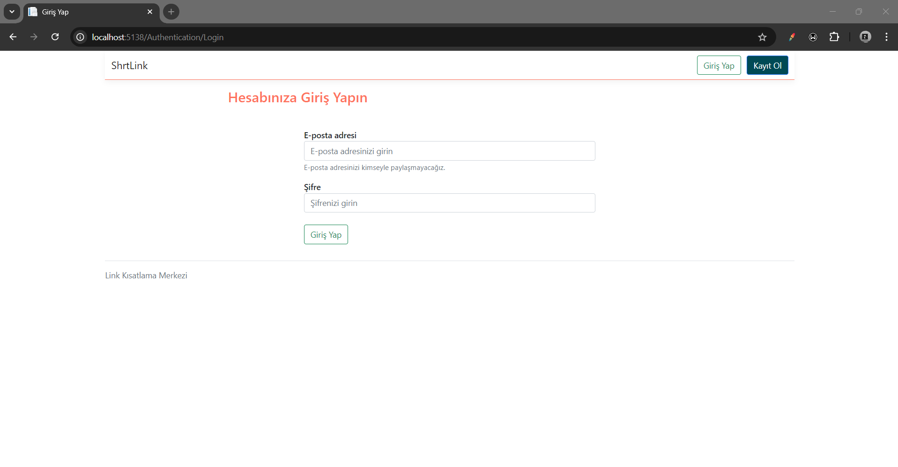
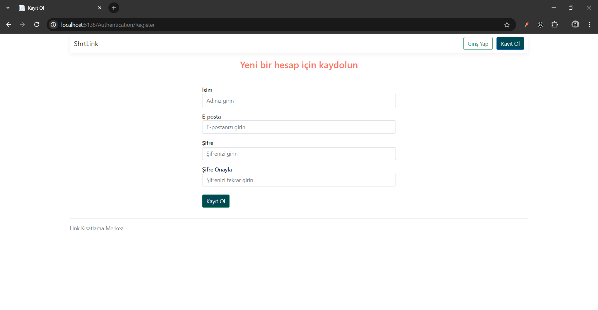
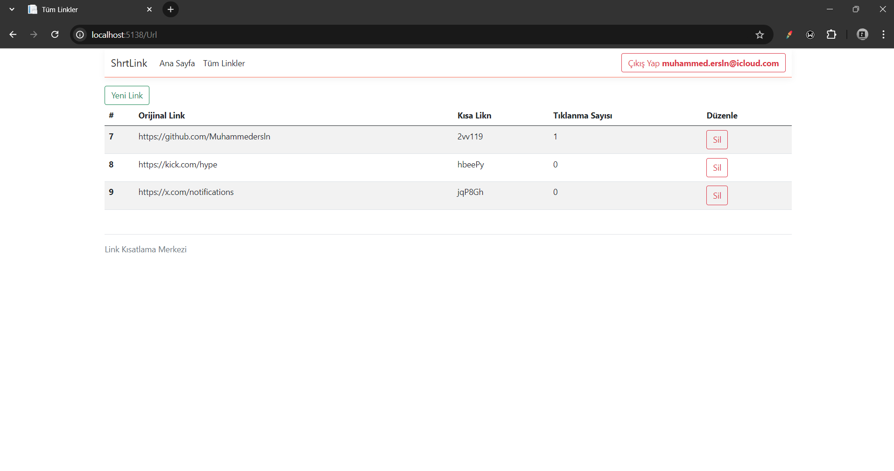

# Link Shortening Project





This project, built with .NET, allows you to transform long URLs into shorter, more manageable ones. It enables users to easily create and manage shortened URLs.

## Features

- Shorten long URLs
- Manage shortened URLs
- Track the click count of shortened URLs
- User-friendly interface

## Installation

To run the project on your local machine, follow these steps:

1. Clone this repository:
   ```bash
   git clone https://github.com/your-username/project-name.git
